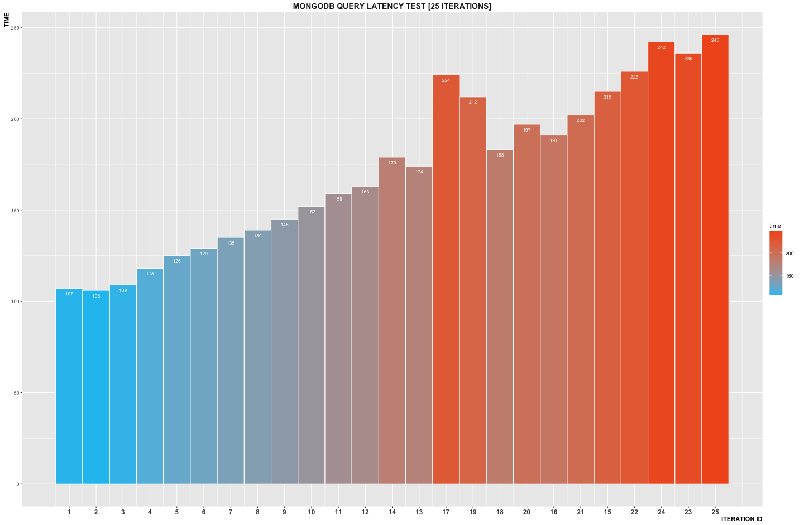
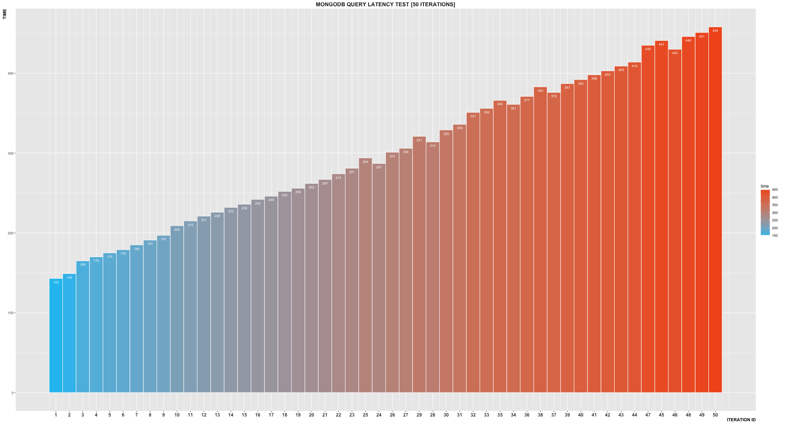
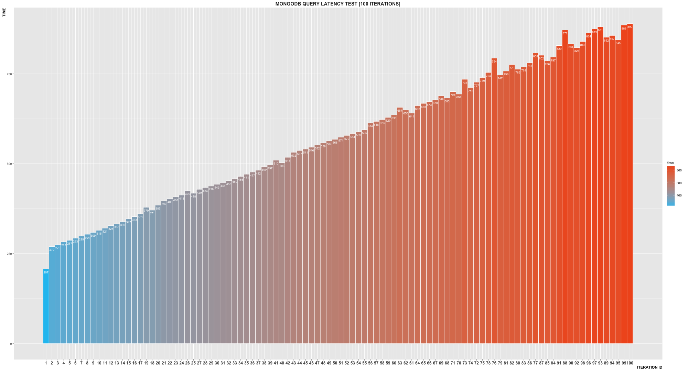
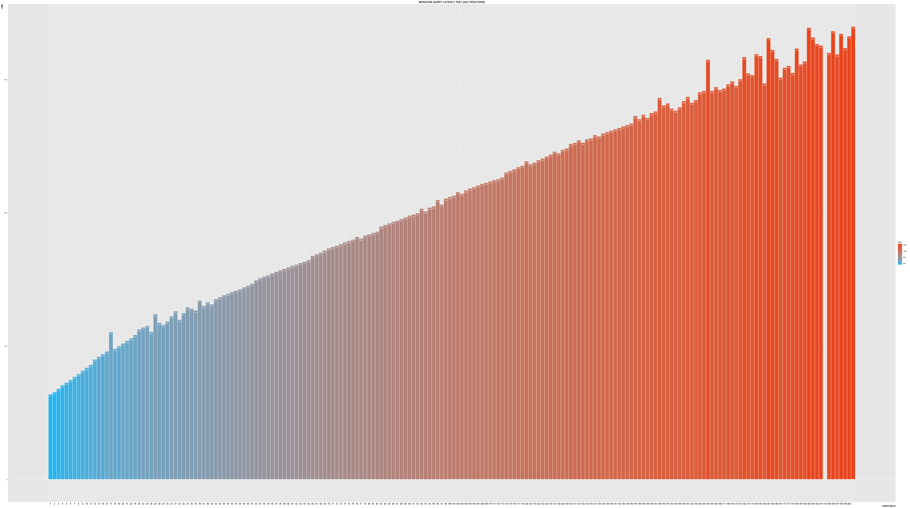

###N meetings:
As of 9/16/2016 there are 3,652 meetings in 1,013 unique locations.

###Meetings on Tuesday at/or after 7pm:

###Total
```
[ { _id: null, count: 305 } ]
```
###Count per hour

```
[ { _id: '19:00', count: 68 },
  { _id: '19:15', count: 19 },
  { _id: '19:30', count: 88 },
  { _id: '19:45', count: 4 },
  { _id: '20:00', count: 73 },
  { _id: '20:15', count: 9 },
  { _id: '20:30', count: 19 },
  { _id: '20:45', count: 5 },
  { _id: '21:00', count: 7 },
  { _id: '21:15', count: 3 },
  { _id: '21:30', count: 1 },
  { _id: '22:00', count: 5 },
  { _id: '22:30', count: 1 },
  { _id: '00:00', count: 2 },
  { _id: '02:00', count: 1 } ]
```


### Meeting format


```
 { _id: 57ec65aad8a2e7097003ac98,
    location: 'Zion Episcopal Church',
    group: 'WAPPINGERS FALLS-HUGHSONVILLE (Group #120340)\nLast Tuesday of Month - Tradition\nLast Saturday of Month - Anniversary',
    region: 'Putnam and Dutchess Counties',
    type: 'Open, Wheelchair Accessible',
    locationNotes: 'East Main St',
    lastContact: '',
    fullLocation: 'Zion Episcopal Church, 12 Saterlee Place Wappingers Falls, NY 12590',
    day: 'Tuesday',
    startTime: '20:30',
    endTime: '21:30',
    latLong: { lat: 41.5975536, lng: -73.9187994 },
    formattedLocation: '12 Saterlee Pl, Wappingers Falls, NY 12590, USA' }
```

### Profiler 

- the connections are indeed concurrent. The database errors at around 230 concurrent connections and the profiler fails.
- notice the order of the processes - they do not return in order

### At 25 iterations




### At 50 iterations




### At 100 iterations



### At 200 iterations




  
