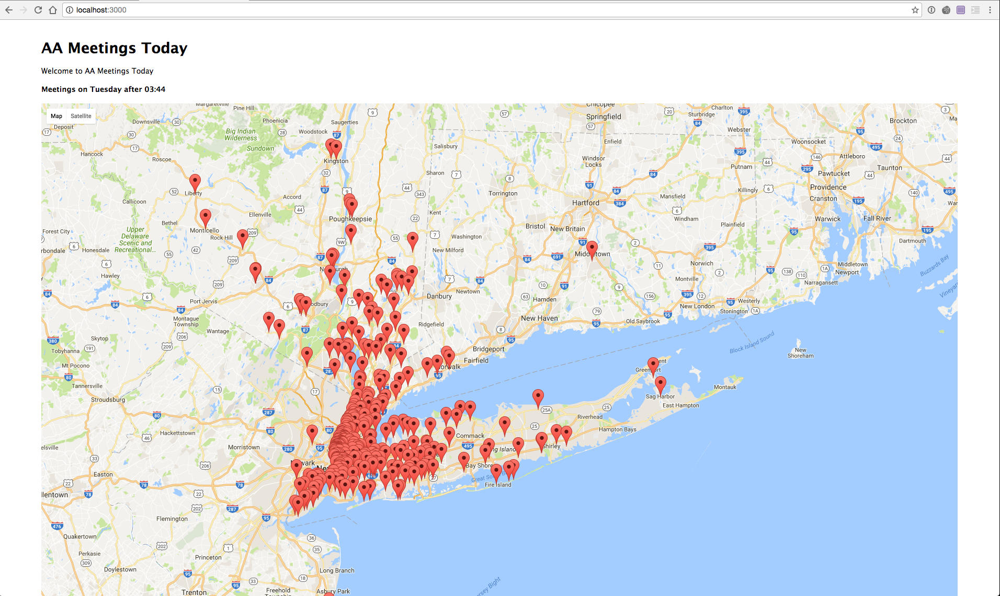
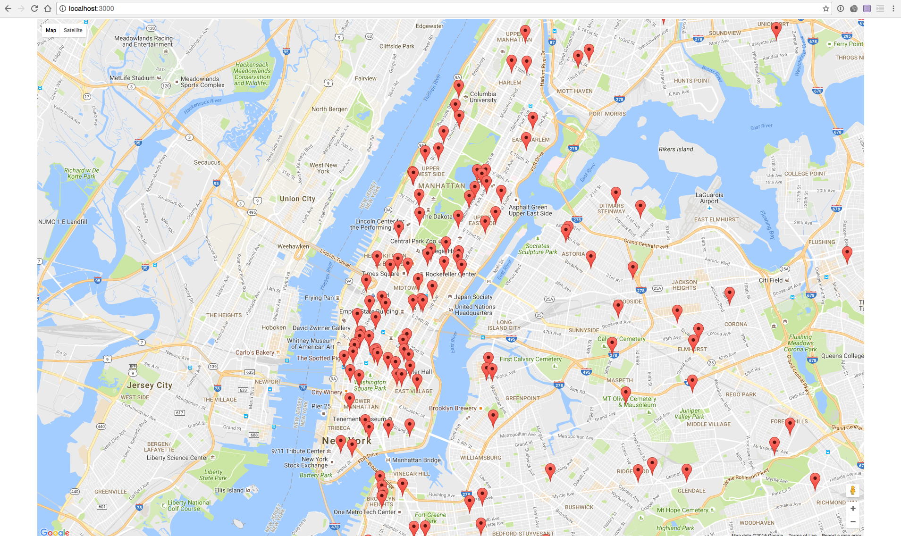
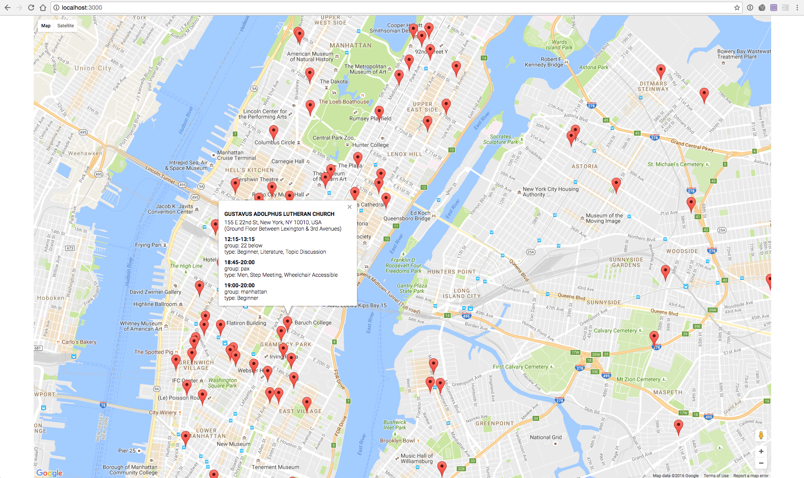

#### Final Project 1





#### MongoDB Query
```
var collection = db.collection(collectionName);
            var pipe = [{
                $match: { $and: [
                    { day: day },
                    { $or:[
                     { startTime : {$gte: time} },
                     // we have to catch meetings after midnight as well
                     { startTime : {$gte: "00:00", $lt: "05:00"} }
                ]}
                ] }},
                {$sort:{"startTime":1}},
                 { $group: {
                    _id: {
                        latLong: "$latLong",
                        location: "$location",
                        formattedLocation: "$formattedLocation",
                        locationNotes: "$locationNotes"
                    },
                    meetings: {
                        $push:  {
                            group: "$group",
                            type: "$type",
                            startTime: "$startTime",
                            endTime: "$endTime"
                        }
              } } }
                // this is for debugging
                 // { $group: { _id: "$startTime", count: { $sum: 1 } } },
                 //{ $sort : { _id: 1 } }
            ];
```


#### EXPRESS API running on port 3000 
- UiAPP/ contains the app running the google maps plot

- Endpoint is @
/api/meetings
