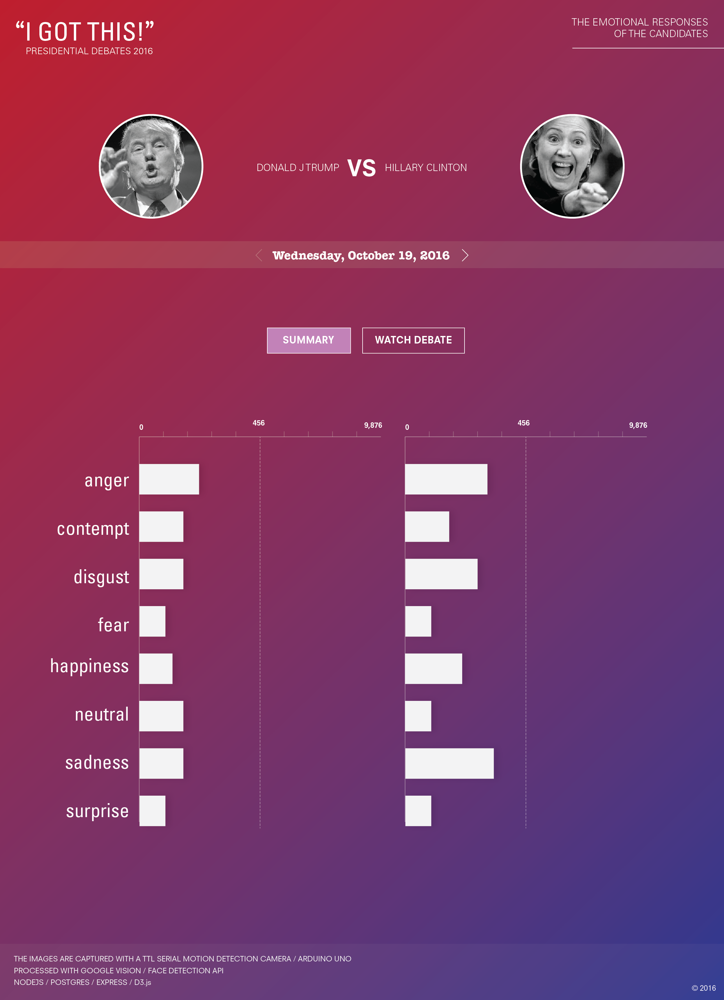
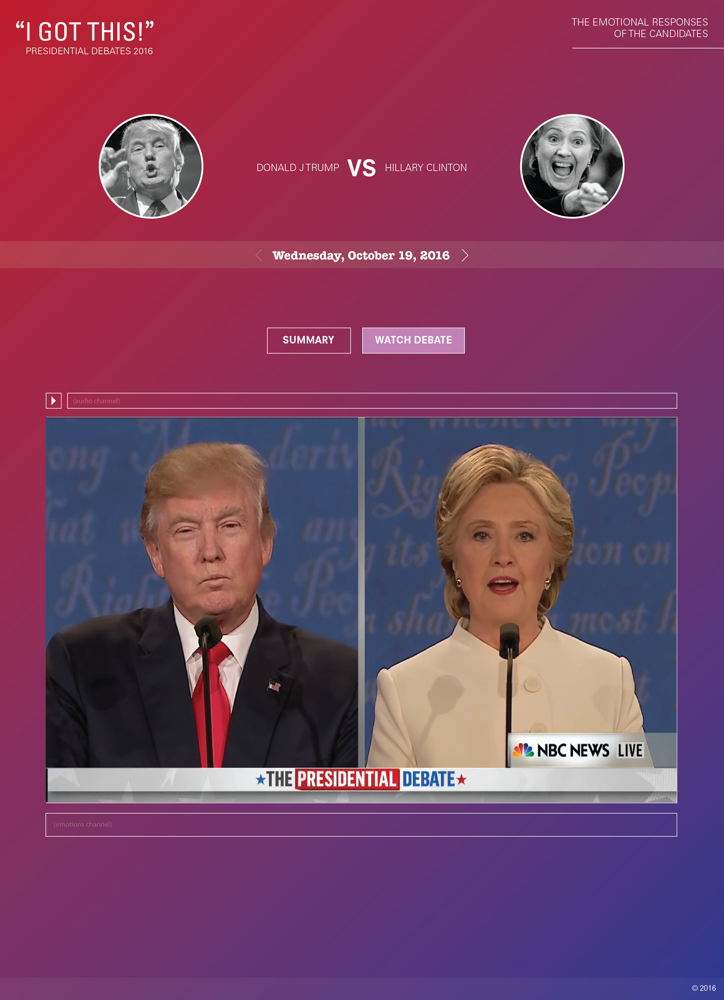

### Final Assignment 2 v1

###About:
AI Emotions analysis of static images

- Source: The last Presidential Debate on October 19th, 2016
- Output: 10,977 images captured
- Analysis: Microsoft Cognitive Services API

Postgres DB:

- The final debate is represented by 11,972 rows
- The number of unique shots is 10,977
- Some of them (at the end of the debate where they show multiple people) have multiple faces and hence multiple emotions

Sample images in:

- sample_shots/

All images:
- The entire collection is in an S3 bucket on AWS

###Files:
- metadata/debate_October_19_2016.json - contains the metadata associated with each image 
- metadata/finalDataset.json - contains each image with the emotion detected. I settled on Microsoft Cognitive Services eventually. Google Vision did not perform nearly as accurately and has less emotions it can detect. 
- metadata/withVision.json - contains some results from Google Vision

###Pipeline for video processing:
- script: pipeline.js
- local dependencies: ffmpeg and imagemagic with the png delegate
- npm dependencies in package.json
- caution: to run the entire pipeline from start to finish takes about ~20 hours.

#####Metadata object - one for each of the 10,977 images
- My work was complicated by the frames that contained both Hillary and the Donald. I have split the images programmatically and _isDouble_ pertains to the image source being a double frame containing both.
- Time is time elapsed since start of debate

```js
{
    "id": "1820",
    "img": "isDouble-1820-shot.png",
    "sec": "1820",
    "time": "00:30:20",
    "debateDate": "October_19_2016",
    "who": "isTrump",
    "isDouble": true,
    "location": "shots/October_19_2016/doubles_split/isTrump-1820-shot.png",
    "sentiment": [
      {
        "faceRectangle": {
          "height": 226,
          "left": 227,
          "top": 144,
          "width": 226
        },
        "scores": {
          "anger": 0.04052857,
          "contempt": 0.0263373815,
          "disgust": 0.004114543,
          "fear": 0.0000316101432,
          "happiness": 0.00000184808732,
          "neutral": 0.436605871,
          "sadness": 0.492295146,
          "surprise": 0.00008503882
        }
      }
    ]
  }
```
#####The pipeline

```js
//**************** PIPELINE DEBATE *****************//

//***** Get the shots *****************//
//  @ accepts a local video file as an argument
//  @ returns a screenshot for each second of video
//*****//

var Oct_19 = new VideoProcessor({
  video: "debates/The_Third_Presidential_Debate_October_19_2016.mp4",
  skipBeginning: (7.3 * 60),
  saveTo: "shots/October_19_2016",
  // flip init boolean to start the image capturing process
  // it takes ~5 hours to finish processing
  init: false
});

//***** Edit images and get metadata *****************//
//  @ pass the folder with the images returned from VideoProcessor
//  @ returns a split version of the frames that contain both the
//    Donald and Hillary if splitShots is enabled
//  @ returns a metadata json file containing the location 
//    of each shot and its metadata if getMetaData is enabled
//*****//

var processor = new ProcessShots({
  // location of shots returned from VideoProcessor
  files: "shots/October_19_2016/",
  debateDate: "October_19_2016",
  // flip boolean to execute any of the function
  splitShots: false, // takes about ~3 hours
  getMetaData: false
});

//***** Process Emotions *****************//
//  @ pass the metadata json returned from processor
//  @ returns a json with emotions analysis
//  @ this takes about ~10 hours to complete
//  @ there are 10,977 shots to process
//*****//

var processEmotions = new Emotions("debate_October_19_2016.json", false);

//  @ then pass the json returned from processEmotions
//  @ run as many times as needed to make the requests that failed
//  @ the constructor will output a message when all checks are
//    passed and all shots are processed
//*****//

var fixMissingEmotions = new Emotions("withEmotionsFinal.json", false);

//***** Post Processing  *****************//
//  @ pass the json returned from fixMissingEmotions
//  @ returns a json that is sorted and duplicates are removed
//*****//

var postProcess = new PostProcessingData("withEmotionsFinal.json", false);

//***** Resize Shots  *****************//
//  @ pass the json returned from postProcess
//  @ returns the images resized for browser view
//*****//
var resizer = new ShotsEditor({
  shotsSrc: "metadata/finalDataset.json",
  destSrc: "/Volumes/SmartBox/DebatesShotsResized/",
  resize: false // flip this to start the process
});

//***** Upload to S3 Bucket on AWS *****************//
//  @ I did this last step via the browser ftp 
//  as I had to move on to the database schema and setup
//  but it could be done with the npm aws-sdk
//*****//

```
<br>
<br>

#### POSTREGS SETUP AND INSERT:
- script: db.js

####Table definition

```
CREATE TABLE debates 
(
id smallint, 
image_name varchar(500), 
image_link varchar(1500), 
date_debate date, 
is_double_shot boolean, 
time_shot_secs smallint, 
time_shot varchar(30), 
who varchar(100), 
anger decimal(5,2), 
contempt decimal(5,2), 
disgust decimal(5,2), 
fear decimal(5,2), 
happiness decimal(5,2), 
neutral decimal(5,2), 
sadness decimal(5,2), 
surprise decimal(5,2)
);
```

- table check

```
SELECT COUNT(*) AS nrows FROM DEBATES
```

- result

```
Row count: Result {
  command: 'SELECT',
  rowCount: 1,
  oid: NaN,
  rows: [ anonymous { nrows: '11972' } ],
  fields: 
   [ Field {
       name: 'nrows',
       tableID: 0,
       columnID: 0,
       dataTypeID: 20,
       dataTypeSize: 8,
       dataTypeModifier: -1,
       format: 'text' } ],
  _parsers: [ [Function: parseBigInteger] ],
  RowCtor: [Function: anonymous],
  rowAsArray: false,
  _getTypeParser: [Function: bound ] }
```

<br>
<br>

#### EXPRESS API & QUERIES:
- The app is running on port 3000

### Available Endpoints

- **api/all** - returns all of the images and emotions

- **api/dominant** - returns the dominant emotion (one of anger, contempt, disgust, fear, happiness, neutral, sadness, surprise) 

#### Query

```
SELECT CASE 
greatest(anger, contempt, disgust, fear, happiness, neutral, sadness, surprise) 
WHEN anger THEN 'anger' 
WHEN contempt THEN 'contempt' 
WHEN disgust THEN 'disgust' 
WHEN fear THEN 'fear' 
WHEN happiness THEN 'happiness' 
WHEN neutral THEN 'neutral' 
WHEN sadness THEN 'sadness' 
WHEN surprise THEN 'surprise' 
END AS Emotion, 
id, image_name, time_shot_secs, time_shot, who 
FROM debates
```
#### Query Result (subset)

```
{
  "command": "SELECT",
  "rowCount": 11972,
  "oid": null,
  "rows": [
    {
      "emotion": "neutral",
      "id": 438,
      "image_name": "isHillary-438-shot.png",
      "time_shot_secs": 438,
      "time_shot": "00:07:18",
      "who": "isHillary"
    },
    {
      "emotion": "neutral",
      "id": 439,
      "image_name": "isHillary-439-shot.png",
      "time_shot_secs": 439,
      "time_shot": "00:07:19",
      "who": "isHillary"
    },
    {
      "emotion": "neutral",
      "id": 440,
      "image_name": "isHillary-440-shot.png",
      "time_shot_secs": 440,
      "time_shot": "00:07:20",
      "who": "isHillary"
    },
    {
      "emotion": "neutral",
      "id": 441,
      "image_name": "isHillary-441-shot.png",
      "time_shot_secs": 441,
      "time_shot": "00:07:21",
      "who": "isHillary"
    },
    {
      "emotion": "neutral",
      "id": 442,
      "image_name": "isHillary-442-shot.png",
      "time_shot_secs": 442,
      "time_shot": "00:07:22",
      "who": "isHillary"
    },
    {
      "emotion": "neutral",
      "id": 443,
      "image_name": "isHillary-443-shot.png",
      "time_shot_secs": 443,
      "time_shot": "00:07:23",
      "who": "isHillary"
    },
    {
      "emotion": "neutral",
      "id": 444,
      "image_name": "isHillary-444-shot.png",
      "time_shot_secs": 444,
      "time_shot": "00:07:24",
      "who": "isHillary"
    },
    {
      "emotion": "neutral",
      "id": 445,
      "image_name": "isHillary-445-shot.png",
      "time_shot_secs": 445,
      "time_shot": "00:07:25",
      "who": "isHillary"
    },
    {
      "emotion": "neutral",
      "id": 446,
      "image_name": "isHillary-446-shot.png",
      "time_shot_secs": 446,
      "time_shot": "00:07:26",
      "who": "isHillary"
    },
    {
      "emotion": "neutral",
      "id": 447,
      "image_name": "isHillary-447-shot.png",
      "time_shot_secs": 447,
      "time_shot": "00:07:27",
      "who": "isHillary"
    },
    {
      "emotion": "neutral",
      "id": 448,
      "image_name": "isHillary-448-shot.png",
      "time_shot_secs": 448,
      "time_shot": "00:07:28",
      "who": "isHillary"
    },
    {
      "emotion": "neutral",
      "id": 449,
      "image_name": "isHillary-449-shot.png",
      "time_shot_secs": 449,
      "time_shot": "00:07:29",
      "who": "isHillary"
    },
    {
      "emotion": "neutral",
      "id": 450,
      "image_name": "isHillary-450-shot.png",
      "time_shot_secs": 450,
      "time_shot": "00:07:30",
      "who": "isHillary"
    },
    {
      "emotion": "neutral",
      "id": 451,
      "image_name": "isHillary-451-shot.png",
      "time_shot_secs": 451,
      "time_shot": "00:07:31",
      "who": "isHillary"
    },
    {
      "emotion": "neutral",
      "id": 452,
      "image_name": "isHillary-452-shot.png",
      "time_shot_secs": 452,
      "time_shot": "00:07:32",
      "who": "isHillary"
    },
    {
      "emotion": "neutral",
      "id": 453,
      "image_name": "isHillary-453-shot.png",
      "time_shot_secs": 453,
      "time_shot": "00:07:33",
      "who": "isHillary"
    },
    {
      "emotion": "neutral",
      "id": 454,
      "image_name": "isHillary-454-shot.png",
      "time_shot_secs": 454,
      "time_shot": "00:07:34",
      "who": "isHillary"
    }
  ]
}

```
<br>
<br>

- **api/aggregated** - returns summary of all emotions detected

#### Query

```

SELECT who, 
COUNT(case when anger >= 0.5 then 1 end) as anger, 
COUNT(case when contempt >= 0.5 then 1 end) as contempt, 
COUNT(case when  disgust >= 0.5 then 1 end) as disgust, 
COUNT(case when  fear >= 0.5 then 1 end) as fear, 
COUNT(case when  happiness >= 0.5 then 1 end) as happiness, 
COUNT(case when  neutral >= 0.5 then 1 end) as neutral, 
COUNT(case when  sadness >= 0.5 then 1 end) as sadness, 
COUNT(case when  surprise >= 0.5 then 1 end) as surprise 
FROM debates 
GROUP BY who

```
#### Query Result

```
{
  "command": "SELECT",
  "rowCount": 6,
  "oid": null,
  "rows": [
    {
      "who": "isHillary",
      "anger": "0",
      "contempt": "0",
      "disgust": "0",
      "fear": "0",
      "happiness": "422",
      "neutral": "4165",
      "sadness": "2",
      "surprise": "110"
    },
    {
      "who": "isEnd",
      "anger": "1",
      "contempt": "0",
      "disgust": "0",
      "fear": "0",
      "happiness": "259",
      "neutral": "1326",
      "sadness": "10",
      "surprise": "28"
    },
    {
      "who": "isHost",
      "anger": "0",
      "contempt": "1",
      "disgust": "0",
      "fear": "0",
      "happiness": "60",
      "neutral": "183",
      "sadness": "0",
      "surprise": "0"
    },
    {
      "who": "isTrump",
      "anger": "17",
      "contempt": "4",
      "disgust": "0",
      "fear": "0",
      "happiness": "19",
      "neutral": "3177",
      "sadness": "828",
      "surprise": "81"
    },
    {
      "who": "isGoodbye",
      "anger": "0",
      "contempt": "0",
      "disgust": "0",
      "fear": "0",
      "happiness": "12",
      "neutral": "24",
      "sadness": "0",
      "surprise": "0"
    },
    {
      "who": "isMixed",
      "anger": "0",
      "contempt": "0",
      "disgust": "0",
      "fear": "0",
      "happiness": "12",
      "neutral": "97",
      "sadness": "0",
      "surprise": "2"
    }
  ],
  "fields": [
    {
      "name": "who",
      "tableID": 16396,
      "columnID": 8,
      "dataTypeID": 1043,
      "dataTypeSize": -1,
      "dataTypeModifier": 104,
      "format": "text"
    },
    {
      "name": "anger",
      "tableID": 0,
      "columnID": 0,
      "dataTypeID": 20,
      "dataTypeSize": 8,
      "dataTypeModifier": -1,
      "format": "text"
    },
    {
      "name": "contempt",
      "tableID": 0,
      "columnID": 0,
      "dataTypeID": 20,
      "dataTypeSize": 8,
      "dataTypeModifier": -1,
      "format": "text"
    },
    {
      "name": "disgust",
      "tableID": 0,
      "columnID": 0,
      "dataTypeID": 20,
      "dataTypeSize": 8,
      "dataTypeModifier": -1,
      "format": "text"
    },
    {
      "name": "fear",
      "tableID": 0,
      "columnID": 0,
      "dataTypeID": 20,
      "dataTypeSize": 8,
      "dataTypeModifier": -1,
      "format": "text"
    },
    {
      "name": "happiness",
      "tableID": 0,
      "columnID": 0,
      "dataTypeID": 20,
      "dataTypeSize": 8,
      "dataTypeModifier": -1,
      "format": "text"
    },
    {
      "name": "neutral",
      "tableID": 0,
      "columnID": 0,
      "dataTypeID": 20,
      "dataTypeSize": 8,
      "dataTypeModifier": -1,
      "format": "text"
    },
    {
      "name": "sadness",
      "tableID": 0,
      "columnID": 0,
      "dataTypeID": 20,
      "dataTypeSize": 8,
      "dataTypeModifier": -1,
      "format": "text"
    },
    {
      "name": "surprise",
      "tableID": 0,
      "columnID": 0,
      "dataTypeID": 20,
      "dataTypeSize": 8,
      "dataTypeModifier": -1,
      "format": "text"
    }
  ],
  "_parsers": [null, null, null, null, null, null, null, null, null],
  "rowAsArray": false
}
```

##### These are no longer necessary as I figured out how to aggregate all emotions at once but I am keeping them for the record
- api/aggregate/anger
- api/aggregate/contempt
- api/aggregate/disgust
- api/aggregate/fear
- api/aggregate/happiness
- api/aggregate/neutral
- api/aggregate/sadness
- api/aggregate/surprise

#### Design
##### This one relies on http://localhost:3000/api/aggregated

##### This one relies on http://localhost:3000/api/dominant


